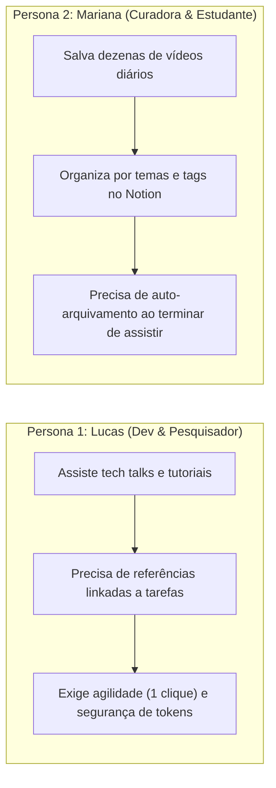
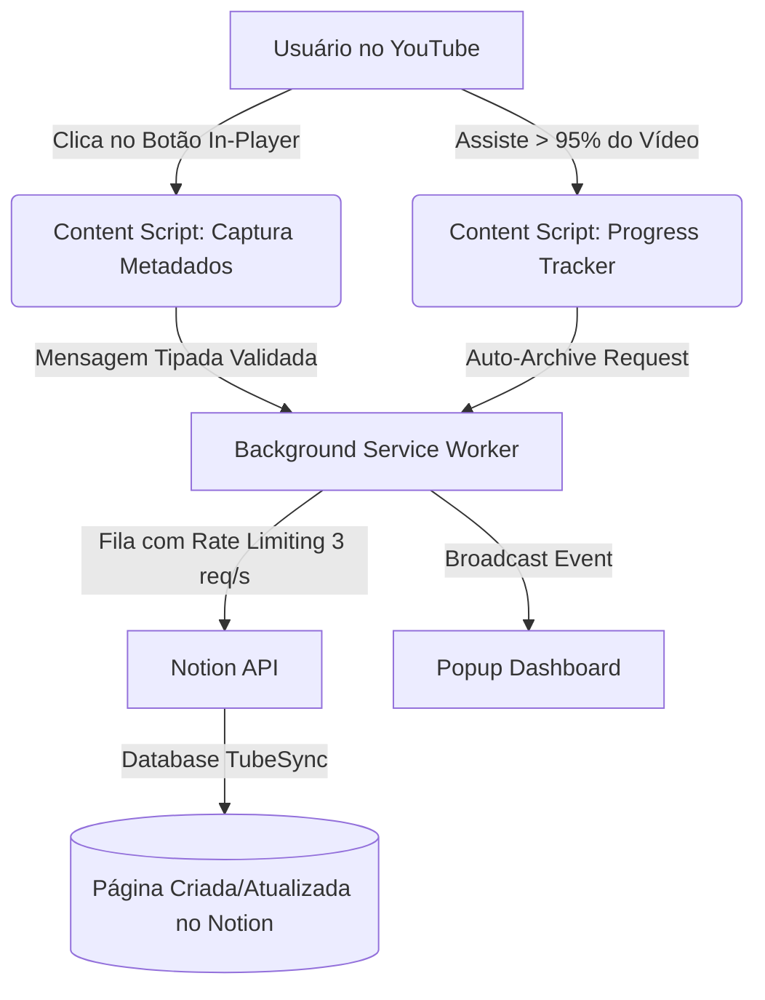
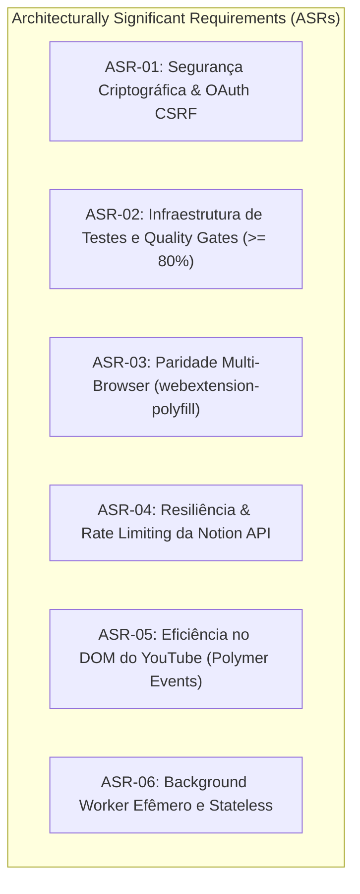

# Product Requirements Document (PRD)

| Metadado | Detalhe |
| :--- | :--- |
| **Identificador** | `PRD-TUBESYNC-001` |
| **Projeto** | [TubeSync](file:///home/ozymandias/Code/tubesync) |
| **Título** | Sincronização Inteligente YouTube ↔ Notion & Arquitetura de Fundação |
| **Versão** | `1.0.0` |
| **Status** | **Aprovado para RFC Técnica** |
| **Autor** | `@spec-master` (Requirements Lead) |
| **Data de Emissão** | 2026-09-27 |
| **Repositório Alvo** | `git@github.com:zatzk/tubesync.git` (branch `main` / `feat/firefox-compatibility`) |

---

## 1. Visão Geral (Overview)

### 1.1 Resumo Executivo
O **TubeSync** é uma extensão de navegador de alto desempenho baseada em **WebExtension Manifest V3** (desenvolvida em React 19, TypeScript e Vite) projetada para integrar o ecossistema de consumo de conteúdo do YouTube ao Notion. A extensão permite capturar, organizar, enriquecer com metadados e rastrear o ciclo de vida de consumo de vídeos diretamente para um banco de dados do Notion com apenas um clique ou de forma automatizada.

O produto resolve a dispersão de conhecimento e o acúmulo desordenado da lista nativa "Assistir Mais Tarde" (*Watch Later*) do YouTube, transformando vídeos em itens de conhecimento acionáveis dentro do espaço de trabalho do usuário.

### 1.2 Proposta de Valor
- **Captura sem Fricção:** Botão contextual injetado diretamente no player do YouTube (`.ytp-right-controls`), menu de contexto do navegador e quick-add via popup.
- **Enriquecimento Automático de Metadados:** Extração resiliente de título, canal, URL canônica, thumbnail em alta definição e tags via scraping leve e fallback para oEmbed nativo do YouTube.
- **Rastreamento de Progresso e Auto-Arquivamento:** Detecção em tempo real de consumo do vídeo via `HTMLVideoElement`, marcando automaticamente o status como arquivado/assistido ao atingir 95% de reprodução.
- **Segurança de Nível Empresarial & Paridade Multi-Navegador:** Arquitetura MV3 com paridade total entre Chromium (Chrome, Edge, Brave) e Gecko (Firefox 109+), armazenamento seguro de credenciais, validação criptográfica de estado no OAuth e validação rígida de mensageria interna.

### 1.3 Objetivos de Negócio & Métricas de Sucesso
- **Latência de Captura:** Tempo de persistência no Notion $< 1.5\text{ s}$ sob condições normais de rede.
- **Impacto de Performance no YouTube:** Zero travamento de quadros (dropped frames) no player; tempo de execução do script de injeção $< 50\text{ ms}$; eliminação de observers contínuos de DOM.
- **Confiabilidade de Sincronização:** Taxa de sucesso de requisições à API do Notion $> 99.5\%$, suportada por filas de rate limit e retries exponenciais com jitter.
- **Cobertura de Testes Automatizados:** Elevação da cobertura de testes de 0% para $\ge 80\%$ em regras de negócio, serializadores e segurança, com pipeline de CI bloqueante no GitHub Actions.

---

## 2. Problema & Oportunidade (Problem & Opportunity)

### 2.1 Análise da Dor do Usuário
A funcionalidade nativa "Assistir Mais Tarde" do YouTube sofre de limitações severas para usuários que utilizam vídeos como fonte de estudo, pesquisa e trabalho:
1. **Falta de Contexto e Notas:** O YouTube não permite adicionar notas, resumos, tags de projeto ou prioridades aos vídeos salvos.
2. **Cemitério de Conteúdo:** Usuários acumulam centenas de vídeos sem visibilidade de quais já foram vistos, quais são referências permanentes e quais devem ser descartados.
3. **Desconexão do Segundo Cérebro (*Second Brain*):** Profissionais e estudantes organizam suas vidas no Notion, exigindo a cópia manual de links, títulos e nomes de canais — um processo tedioso de múltiplos cliques e trocas de abas.
4. **Perda de Vídeos Apagados/Privados:** Quando um vídeo no "Assistir Mais Tarde" nativo se torna privado ou deletado, o YouTube oculta o título e o canal, impossibilitando identificar qual era o conteúdo salvo.

### 2.2 Diagnóstico do Estado Atual do Código (Baseline Técnica)
A auditoria forense no repositório identificou fundações sólidas de interface ([`src/components/DashboardScreen.tsx`](file:///home/ozymandias/Code/tubesync/src/components/DashboardScreen.tsx), [`src/components/OnboardingScreen.tsx`](file:///home/ozymandias/Code/tubesync/src/components/OnboardingScreen.tsx)), porém com **lacunas arquiteturais críticas** que inviabilizam a liberação para produção:
- **Vulnerabilidade de Segurança em OAuth:** O fluxo de autorização via `browser.identity.launchWebAuthFlow` em [`src/background/index.ts`](file:///home/ozymandias/Code/tubesync/src/background/index.ts#L70-L82) não implementa verificação de parâmetro `state`, tornando o fluxo vulnerável a ataques de fixação de sessão e CSRF.
- **Credenciais em Texto Puro:** O token da API do Notion é gravado sem qualquer camada de cifragem ou isolamento em repouso no `chrome.storage.local` ([`src/services/storage.ts`](file:///home/ozymandias/Code/tubesync/src/services/storage.ts#L14-L26)).
- **Mensageria Aberta e Insegura:** O listener global de mensagens aceita payloads arbitrários sem checar a identidade do remetente (`sender.id === chrome.runtime.id`), permitindo potenciais abusos de mutação via websites maliciosos na mesma origem de mensageria.
- **Desrespeito ao Rate Limit da Notion API:** A API pública do Notion possui limite restrito de 3 requisições por segundo. Atualmente não há fila de espera (Token/Leaky Bucket) ou backoff exponencial; disparos rápidos resultam em HTTP 429 não tratados.
- **Inconsistência de Polyfill:** Mistura direta do namespace `chrome.*` com `browser.*` da biblioteca `webextension-polyfill`, provocando quebras no Firefox.
- **Degradação de CPU no YouTube:** O content script utiliza `MutationObserver` monitorando todo o `document.documentElement` com `{ childList: true, subtree: true }` a cada alteração do DOM, desperdiçando ciclos de CPU em vez de escutar eventos canônicos do Polymer (`yt-navigate-finish`).
- **Zero Cobertura de Testes (0%):** O projeto não possui test runner (`vitest`), mocks de WebExtension ou suíte E2E configurada.

---

## 3. Personas de Usuário (User Personas)



### Persona 1: Lucas Silva — Engenheiro de Software & Pesquisador
- **Perfil:** 28 anos, desenvolvedor sênior, usuário avançado de Linux/macOS, trabalha com Chrome e Firefox.
- **Comportamento:** Assiste a palestras de conferências, análises arquiteturais e tutoriais avançados de programação.
- **Objetivo:** Adicionar vídeos à sua base de conhecimento no Notion sem sair da aba do YouTube, categorizando com tags e preservando canal e thumbnail para consulta futura.
- **Frustrações:** Extensões lentas que engasgam o player do YouTube; extensões que vazam tokens ou exigem permissões abusivas de leitura de histórico.

### Persona 2: Mariana Rocha — Curadora de Conteúdo & Lifelong Learner
- **Perfil:** 34 anos, gestora de marketing e estudante contínua de design e negócios.
- **Comportamento:** Salva diariamente vídeos longos, podcasts e documentários para assistir no fim de semana.
- **Objetivo:** Uma fila limpa e organizada no Notion onde os vídeos assistidos desapareçam automaticamente da lista "To Watch" assim que os créditos finais começarem.
- **Frustrações:** Ter que abrir o Notion manualmente para marcar cada item assistido como "Watched" ou "Archived".

---

## 4. Requisitos Funcionais (FRs)



### RF-01: Autenticação Notion Segura via OAuth 2.0
- **RF-01.1:** A extensão deve fornecer um fluxo guiado de autorização OAuth 2.0 integrado à API oficial do Notion através do endpoint `https://api.notion.com/v1/oauth/authorize`.
- **RF-01.2:** A URL de autorização deve obrigatoriamente incluir um parâmetro criptograficamente seguro `state` gerado no cliente e armazenado em sessão transitória, validado no retorno do redirect para proteção contra ataques CSRF e session fixation.
- **RF-01.3:** A troca do código de autorização (`code`) pelo `access_token` deve ser intermediada por um Cloudflare Worker proxy seguro (`https://tubesync-auth.juniorjean7.workers.dev`), impedindo que o `client_secret` seja exposto no bundle do cliente.
- **RF-01.4:** Ao autenticar com sucesso, a extensão deve persistir de forma segura o `access_token`, `workspace_name`, `workspace_icon`, `workspace_id` e `bot_id`.
- **RF-01.5:** Deve ser disponibilizado botão de desconexão explícita no painel de configurações, limpando todos os tokens e estados armazenados localmente e resetando a interface para a tela de onboarding.

### RF-02: Gerenciamento e Auto-Provisionamento de Database Notion
- **RF-02.1:** A extensão deve permitir ao usuário selecionar um banco de dados já existente em seu workspace através do endpoint `/v1/search` com filtro `property: "object", value: "database"`.
- **RF-02.2:** A extensão deve oferecer uma opção com 1 clique para auto-provisionamento de um banco de dados com schema padronizado (*Template DB*), denominado **"TubeSync Watch Later"**, sob uma página pai selecionada pelo usuário.
- **RF-02.3:** O schema padronizado gerado deve conter estritamente as propriedades:
  - `Title` (tipo `title`): Título do vídeo.
  - `URL` (tipo `url`): Link canônico do YouTube.
  - `Channel` (tipo `rich_text`): Nome do canal criador.
  - `Status` (tipo `select`): Opções `To Watch` (Azul, padrão), `Watched` (Verde), `Archived` (Cinza).
  - `Tags` (tipo `multi_select`): Tags extraídas do vídeo.
  - `Reference` (tipo `checkbox`): Indicador de referência permanente.
  - `Added On` (tipo `date`): Data da captura em formato ISO (YYYY-MM-DD).
  - `Cover` (tipo `external`): URL da thumbnail externa.
- **RF-02.4:** O ID do banco de dados ativo deve ser persistido em storage local para uso de todas as rotinas de captura.

### RF-03: Injeção de UI Dinâmica no Player do YouTube
- **RF-03.1:** O content script deve injetar um botão de captura estilizado com a identidade visual do TubeSync na barra de controle inferior direita do player nativo do YouTube (`.ytp-right-controls`).
- **RF-03.2:** A injeção deve ser executada exclusivamente em páginas de reprodução de vídeo (`/watch?v=...`) e tolerante a re-renderizações e transições de página SPA (*Single Page Application*) do Polymer.
- **RF-03.3:** O botão deve fornecer feedback visual instantâneo durante os estados do ciclo de vida:
  - **Repouso:** Opacidade 100%, tooltip `"Save to TubeSync"`.
  - **Processando:** Opacidade 40%, tooltip `"Saving..."`.
  - **Sucesso:** Tooltip `"✓ Saved to TubeSync!"` com restauração automática do estado inicial após 2.5 segundos.
  - **Falha:** Tooltip descritivo com a causa do erro (ex: `"Error: Rate limit reached"`) com restauração após 4 segundos.
- **RF-03.4:** O botão deve respeitar a preferência de desativação do usuário (`player_integration: false`) configurável nas opções da extensão.

### RF-04: Extração Robusta de Metadados de Vídeo
- **RF-04.1:** Ao acionar o salvamento, o content script deve extrair com precisão:
  - `videoId`: Extraído dos parâmetros de URL (`?v=`) ou caminhos curtos `/shorts/`.
  - `url`: URL canônica normalizada no padrão `https://www.youtube.com/watch?v={videoId}`.
  - `title`: Extraído dos elementos canônicos do Polymer (`h1.ytd-watch-metadata yt-formatted-string`, com fallback para `document.title`).
  - `channel`: Extraído de `ytd-video-owner-renderer #channel-name a` com seletores de redundância.
  - `thumbnail`: Gerada diretamente via CDN oficial do YouTube (`https://i.ytimg.com/vi/{videoId}/maxresdefault.jpg` com fallback imediato para `mqdefault.jpg`).
  - `tags`: Extraídas de tags `<meta name="keywords">` da página (limitadas às primeiras 10 tags mais relevantes).
- **RF-04.2:** Caso o salvamento ocorra fora de uma página ativa de reprodução (ex: via menu de contexto em um link), o Service Worker em background deve buscar os metadados faltantes utilizando o serviço oficial YouTube oEmbed (`https://www.youtube.com/oembed?url={url}&format=json`).

### RF-05: Rastreamento de Progresso e Auto-Arquivamento
- **RF-05.1:** O content script deve monitorar a reprodução do elemento `<video class="html5-main-video">`.
- **RF-05.2:** Quando a proporção de reprodução `currentTime / duration` ultrapassar **95%**, a extensão deve disparar uma mensagem assíncrona `AUTO_ARCHIVE_VIDEO`.
- **RF-05.3:** O Service Worker deve buscar o registro correspondente no banco de dados do Notion com status `To Watch` ou `Watched` e atualizar atômica e idempotentemente a propriedade `Status` para `Archived`.
- **RF-05.4:** A rotina deve possuir proteção de disparo único por vídeo por sessão (evitando loops de requisições causados por eventos contínuos de `timeupdate`).
- **RF-05.5:** A funcionalidade deve ser executada apenas se a flag `auto_archive` estiver habilitada pelo usuário nas configurações (habilitada por padrão).

### RF-06: Menu de Contexto do Navegador
- **RF-06.1:** A extensão deve registrar uma entrada no menu de contexto nativo do navegador com o título `"Save to TubeSync"`.
- **RF-06.2:** A opção deve estar visível ao clicar com botão direito sobre links do YouTube (`contexts: ["link"]`), na própria página de vídeo (`contexts: ["page"]`) ou sobre o elemento de vídeo (`contexts: ["video"]`).
- **RF-06.3:** Ao ser acionado, o background worker deve resolver a URL, enriquecer os metadados via oEmbed se necessário, enfileirar a criação na API do Notion e notificar o dashboard via broadcast event `VIDEO_SAVED`.

### RF-07: Interface Popup & Dashboard de Gerenciamento
- **RF-07.1:** O popup deve exibir um cabeçalho fixo com logotipo, nome do workspace ativo, ícone de status e botão para tela de configurações.
- **RF-07.2:** O dashboard deve prover navegação por abas:
  - **"To Watch":** Lista vídeos com status pendente de visualização.
  - **"Reference":** Lista vídeos marcados com a flag de referência duradoura (`Reference = true`).
- **RF-07.3:** Campo de busca rápida com filtragem local por título ou canal em tempo real.
- **RF-07.4:** Formulário de adição rápida (*Quick Add*) no topo da lista permitindo colar qualquer URL do YouTube e persistir diretamente no Notion.
- **RF-07.5:** Ações rápidas em cada card de vídeo da lista:
  - Botão de alternância do status entre `To Watch` e `Watched`.
  - Botão de toggle para marcar/desmarcar como `Reference`.
  - Botão para exclusão/arquivamento do item no Notion.
- **RF-07.6:** Sincronização reativa: o dashboard deve recarregar a lista automaticamente ao receber eventos em tempo real (`VIDEO_SAVED`).

### RF-08: Configurações & Parâmetros do Usuário
- **RF-08.1:** Permitir alternar os toggles de:
  - `player_integration`: Exibição do botão no player do YouTube.
  - `auto_archive`: Arquivamento automático aos 95% de progresso.
- **RF-08.2:** Permitir selecionar um novo banco de dados ativo sem necessidade de reautenticação.
- **RF-08.3:** Exibir identificadores do workspace e versão instalada da extensão.

---

## 5. Requisitos Não-Funcionais (NFRs) & ASRs

As seções a seguir detalham os **Requisitos Arquiteturalmente Significativos (ASRs)** com ênfase máxima em **Segurança**, **Testabilidade** e **Robustez de Sistemas**.



### 5.1 ASR-01: Segurança Criptográfica, Proteção OAuth e Isolamento de Mensageria
- **NFR-SEC-01 (Mitigação CSRF via State Criptográfico):** O background worker deve gerar um identificador aleatório com entropia de 128 bits (via `crypto.getRandomValues`) e transmiti-lo como parâmetro `state` na URL de autorização OAuth. Ao retornar do `launchWebAuthFlow`, a extensão deve rejeitar qualquer resposta cujo `state` não corresponda exatamente ao valor registrado localmente.
- **NFR-SEC-02 (Criptografia em Repouso do Token Notion):** O token da API do Notion (`notion_token`) não deve ser mantido em texto claro no `chrome.storage.local`. A persistência deve utilizar cifra autenticada **AES-256-GCM** (Web Crypto API) com derivação de chave simétrica local, prevenindo leitura direta de credenciais por ferramentas de auditoria de terceiros ou extensões não autorizadas.
- **NFR-SEC-03 (Validação e Blindagem de Remetente de Mensagens):** Todo listener de mensageria (`browser.runtime.onMessage`) deve rejeitar estritamente mensagens cujo `sender.id !== browser.runtime.id`. Mensagens originadas de abas devem validar obrigatoriamente se `sender.origin` ou `sender.url` pertence ao domínio permitido `https://www.youtube.com/*`. Payloads devem ser validados contra schemas tipados em tempo de execução (via Zod ou Type Guards determinísticos) antes de qualquer operação de escrita.
- **NFR-SEC-04 (Content Security Policy Restritiva):** O [`manifest.json`](file:///home/ozymandias/Code/tubesync/manifest.json) deve declarar uma `content_security_policy` restritiva para o popup e páginas da extensão, barrando totalmente `unsafe-eval`, conexões para origens arbitrárias e scripts inline:
  ```json
  "content_security_policy": {
    "extension_pages": "script-src 'self'; object-src 'none'; connect-src 'self' https://api.notion.com https://tubesync-auth.juniorjean7.workers.dev https://www.youtube.com;"
  }
  ```
- **NFR-SEC-05 (Princípio do Menor Privilégio de Host):** As permissões declaradas devem limitar-se estritamente a `*://*.youtube.com/*` e `https://api.notion.com/*`, além das permissões de API `storage`, `contextMenus` e `identity`. Permissões permissivas como `<all_urls>` ou `tabs` sem restrição permanecem proibidas.

### 5.2 ASR-02: Infraestrutura de Testes e Quality Gates (Meta: $\ge 80\%$ Cobertura)
- **NFR-TEST-01 (Test Runner & Ambiente de Execução):** O projeto deve integrar **Vitest** como test runner nativo com suporte a ES Modules, TypeScript e execução multithreaded ultrarrápida, acoplado ao `happy-dom` para emulação leve e eficiente de ambiente de navegador.
- **NFR-TEST-02 (Harness de Mocks para WebExtensions):** Criação de um utilitário centralizado de mocks determinísticos para a API `webextension-polyfill` (`browser.*`) e `chrome.*` (cobrindo `storage.local`, `runtime.sendMessage`, `runtime.onMessage`, `identity.launchWebAuthFlow` e `contextMenus`).
- **NFR-TEST-03 (Testes Unitários Obrigatórios):**
  - Serializador de payloads da API do Notion (`_saveVideoToNotion` e `createTemplateDatabase`).
  - Funções de extração de metadados ([`getVideoMetadata`](file:///home/ozymandias/Code/tubesync/src/content/youtube.tsx#L21-L48), seletores DOM de título, canal e tags).
  - Normalizador de URLs e extrator de IDs do YouTube (suporte a links longos, curtos `youtu.be`, Shorts e URLs com timestamps).
  - Mecanismos de cifra e decifragem de tokens em repouso.
  - Validador de esquemas de mensagens e filtros de segurança.
- **NFR-TEST-04 (Testes de Integração de Fluxos Críticos):**
  - Simulação completa do fluxo de autenticação OAuth com verificação de sucesso e rejeição por state CSRF inválido.
  - Simulação do rate limiter interceptando rajadas de 10 chamadas e garantindo espaçamento temporal $\le 3\text{ req/s}$.
  - Simulação de erros HTTP 429 da API do Notion e validação dos retries com backoff exponencial.
- **NFR-TEST-05 (Testes E2E de Extensão com Playwright):**
  - Suite de testes End-to-End automatizados via Playwright com a extensão desempacotada carregada em navegador Chromium real:
    - Validação de renderização do popup e fluxo de seleção de banco de dados.
    - Navegação para página mock do YouTube, injeção do botão `#tubesync-save-btn` no player e disparo de clique simulado.
- **NFR-TEST-06 (Quality Gates Bloqueantes em CI/CD):**
  - Workflow de GitHub Actions obrigatório para Pull Requests contendo:
    1. Verificação estrita de tipagem TypeScript: `tsc --noEmit`.
    2. Análise estática com ESLint: `npm run lint`.
    3. Execução completa dos testes automatizados com cálculo de cobertura: `npm run test:coverage`.
    4. Compilação do bundle de produção: `npm run build`.
  - Rejeição automática de PR caso a cobertura caia abaixo do threshold ratcheted de **80% de linhas e branches** no código de serviços e background.

### 5.3 ASR-03: Paridade Multi-Navegador e Compatibilidade Estrita
- **NFR-COMPAT-01 (Abstração Unificada via WebExtension-Polyfill):** Eliminação completa de chamadas diretas ao namespace proprietário `chrome.*` no código de produção. Todas as interações com runtime, storage, identity e context menus devem usar exclusivamente `browser.*` importado de `webextension-polyfill`.
- **NFR-COMPAT-02 (Suporte Simultâneo Chromium & Firefox Gecko):** O bundle gerado deve ser compatível sem alterações estruturais com navegadores Chromium (Manifest V3 service worker) e Firefox Gecko 109+ (declarado com `browser_specific_settings.gecko.id: "tubesync@juniorjean7.dev"`).

### 5.4 ASR-04: Resiliência de Conectividade e Governança de Rate Limits da Notion API
- **NFR-RES-01 (Fila de Controle de Vazão - Leaky/Token Bucket):** Todas as mutações e buscas disparadas contra a API do Notion (`https://api.notion.com/v1/*`) devem obrigatoriamente trafegar por uma fila assíncrona gerenciada no Service Worker, limitando estritamente a taxa de despacho a no máximo **3 requisições por segundo**.
- **NFR-RES-02 (Retry com Exponential Backoff & Full Jitter):** Respostas com status HTTP 429 (*Too Many Requests*) ou HTTP 5xx devem acionar tentativas de retransmissão com cálculo de recuo exponencial com jitter:
  $$t_{\text{backoff}} = \min(t_{\text{max}}, t_{\text{base}} \times 2^{\text{attempt}}) \pm \text{jitter}$$
  Respeitando prioritariamente o cabeçalho `Retry-After` fornecido pelo Notion se presente. Limite máximo de 3 tentativas antes de declarar falha permanente.
- **NFR-RES-03 (Circuit Breaker para Saúde do Endpoint):** Caso 5 requisições consecutivas retornem erro de conexão ou timeout ($\ge 10\text{ s}$), o circuito deve entrar em estado aberto (*Open*) por 30 segundos, notificando imediatamente o usuário sobre a indisponibilidade da API e poupando recursos do dispositivo.

### 5.5 ASR-05: Eficiência Computacional e Performance no DOM do YouTube
- **NFR-PERF-01 (Eliminação de Observer Global de DOM):** Descontinuar o uso de `MutationObserver` irrestrito em `document.documentElement` com `{ subtree: true }`. A detecção de navegação deve escutar prioritariamente os eventos nativos disparados pelo framework Polymer do YouTube (`yt-navigate-finish` e `yt-page-data-updated`).
- **NFR-PERF-02 (Orçamento de CPU e Tempo de Injeção):** A rotina de checagem e inserção do botão no player não deve ultrapassar $50\text{ ms}$ de tempo de execução no thread principal da página.
- **NFR-PERF-03 (Consumo de Memória Limpo):** Remoção determinística de listeners e referências de vídeo ao navegar entre páginas para prevenir memory leaks em sessões prolongadas de navegação no YouTube.

### 5.6 ASR-06: Background Worker Efêmero e Stateless
- **NFR-ARCH-01 (Arquitetura sem Estado Volátil):** O Service Worker do Manifest V3 deve operar sob o pressuposto de que pode ser finalizado pelo navegador a qualquer momento após 30 segundos de inatividade. Nenhuma variável global em memória (`window` ou variáveis de módulo voláteis) deve ser assumida como persistente entre chamadas de eventos; todo estado crítico deve ser restaurado de forma atômica a partir do `browser.storage.local`.

---

## 6. Critérios de Aceite (Acceptance Criteria)

Os critérios de aceite a seguir utilizam o formato **BDD (Behavior Driven Development / Given-When-Then)** e devem ser integralmente atendidos para aprovação da entrega.

```gherkin
Cenário CA-01: Autenticação OAuth com Mitigação CSRF
  Dado que o usuário não está autenticado e abre a tela de Onboarding do Popup
  Quando clica no botão "Conectar com Notion"
  Então a extensão gera um token aleatório 'state' criptograficamente seguro e o persiste temporariamente
  E redireciona o usuário para a página de autorização oficial do Notion contendo o 'state' gerado
  E ao receber o callback via launchWebAuthFlow com código de autorização e o parâmetro 'state'
  O background worker valida se o 'state' retornado é idêntico ao valor salvo localmente
  E somente se forem iguais, troca o código pelo access_token via proxy Cloudflare
  E cifra o access_token com AES-GCM antes de gravá-lo no storage local.

Cenário CA-02: Bloqueio de Mensagens Inseguras de Origem Arbitrária
  Dado que uma página web ou script externo tenta enviar uma mensagem para o background worker da extensão
  Quando a mensagem possui remetente com sender.id diferente do ID oficial da extensão
  Ou uma aba com URL não pertencente a "*://*.youtube.com/*" envia uma mensagem do tipo "SAVE_VIDEO"
  Então o background worker deve imediatamente rejeitar o processamento
  E retornar um objeto { success: false, error: "Unauthorized sender" }
  E registrar uma mensagem de auditoria no log de segurança.

Cenário CA-03: Captura de Vídeo In-Player e Persistência no Notion
  Dado que o usuário está assistindo a um vídeo em "https://www.youtube.com/watch?v=dQw4w9WgXcQ"
  E a extensão está autenticada e configurada com uma database válida
  Quando o usuário clica no botão "#tubesync-save-btn" no player
  Então o botão entra em estado "Saving..." com opacidade reduzida
  E o content script extrai título, canal, URL canônica, tags e thumbnail
  E envia uma mensagem tipada "SAVE_VIDEO" para o background worker
  E o background worker despacha uma requisição POST para a API do Notion respeitando a fila de rate limit
  E uma página é criada no Notion com todas as propriedades mapeadas e thumbnail externa como Cover
  E o botão no player transiciona para "✓ Saved to TubeSync!" por 2.5 segundos.

Cenário CA-04: Auto-Arquivamento Idempotente ao Atingir 95% do Vídeo
  Dado que a opção 'auto_archive' está ativada nas configurações
  E o usuário está assistindo a um vídeo que foi previamente salvo no TubeSync
  Quando a reprodução do elemento de vídeo atinge 95.1% da duração total
  Então o content script dispara um evento único "AUTO_ARCHIVE_VIDEO" contendo a URL do vídeo
  E marca o elemento de vídeo com a flag "data-tubesync-archived='true'" para evitar disparos repetidos
  E o background worker localiza o registro do vídeo no Notion e atualiza seu Status para "Archived"
  E nenhuma requisição adicional é disparada caso o usuário retroceda ou repita trechos do vídeo.

Cenário CA-05: Resiliência contra Rate Limit (HTTP 429) da Notion API
  Dado que o usuário aciona o salvamento de 5 vídeos simultaneamente
  Quando as requisições chegam ao background worker
  Então elas devem ser enfileiradas na fila Leaky Bucket com intervalo mínimo de 333 ms entre cada despacho
  E se a API do Notion retornar status HTTP 429 com cabeçalho "Retry-After: 2"
  A fila suspende novos envios pelo intervalo especificado
  E repete a requisição afetada aplicando backoff exponencial com jitter
  E todas as páginas são criadas com sucesso sem perda de dados.

Cenário CA-06: Paridade de Execução no Firefox (Gecko)
  Dado que a extensão é empacotada e carregada no Firefox 109+ em modo temporário
  Quando o usuário interage com o popup, realiza autenticação e navega no YouTube
  Então nenhuma chamada lança exceção do tipo "chrome is not defined"
  E todos os métodos utilizam a API tipada baseada em Promises de "webextension-polyfill"
  E o botão é injetado e funciona de forma idêntica ao Chromium.

Cenário CA-07: Validação Automática de Cobertura e CI
  Dado que um desenvolvedor abre um Pull Request no repositório
  Quando o workflow de CI executa no GitHub Actions
  Então as etapas de lint, typecheck e testes vitest devem passar com 0 falhas
  E o relatório de cobertura gerado por "npm run test:coverage" deve registrar cobertura total >= 80%
  E qualquer violação desses thresholds deve impedir o merge na branch principal.
```

---

## 7. Matriz de Riscos & Mitigações

| ID | Risco Identificado | Severidade | Probabilidade | Estratégia de Mitigação |
| :--- | :--- | :--- | :--- | :--- |
| **RSK-01** | Mudanças inesperadas no DOM do YouTube em testes A/B quebrando seletores | **Alta** | Média | Implementação de seletores de fallback em cascata (Title, Channel) e fallback prioritário para a API de oEmbed do YouTube. |
| **RSK-02** | Exaustão de rate limit na API do Notion (3 req/s) gerando erros para o usuário | **Alta** | Baixa | Fila Leaky Bucket local no Service Worker + Retry com Exponential Backoff e suporte nativo ao cabeçalho `Retry-After`. |
| **RSK-03** | Interceptação ou vazamento de token de integração do Notion | **Crítica** | Baixa | Criptografia local com AES-256-GCM, validação de remetente `browser.runtime.id`, isolamento de Content Script e exclusão do token no DOM. |
| **RSK-04** | Service Worker do Manifest V3 sendo descartado pelo browser no meio de requisição | **Média** | Média | Manter operações atômicas baseadas em Promises, assegurando que o manipulador de mensagens retorne uma Promise ativa para prolongar a vida do worker durante o I/O. |
| **RSK-05** | Indisponibilidade do Cloudflare Worker intermediário de OAuth | **Alta** | Baixa | Health checks no cliente com mensagem de erro clara, redundância regional do Cloudflare e opção avançada para inserção manual de token interno de integração nas configurações. |

---

## 8. Próximos Passos & Transição de Fase

Com a formalização e aprovação deste PRD (`PRD-TUBESYNC-001`), o pipeline de engenharia avança deterministicamente para:

1. **Fase 3: Elaboração da RFC Técnica (`RFC-TUBESYNC-001`)**
   - Modelagem de contratos DTO de mensagens (`src/types/messages.ts`).
   - Desenho do pipeline criptográfico de credenciais no storage local.
   - Especificação do algoritmo de fila de rate limit (Leaky Bucket).
   - Diagrama de Topologia de Sistemas e Diagramas de Sequência Mermaid detalhados.
2. **Fase 4: Auditoria Técnica da RFC**
   - Revisão multi-eixo: Segurança, LLD, Desempenho e DBA (Schemas Notion).
3. **Fase 5: Decomposição em Tarefas Atômicas de Implementação**
   - Configuração de Vitest, Playwright, pipeline CI e refatoração de código orientado a TDD.
