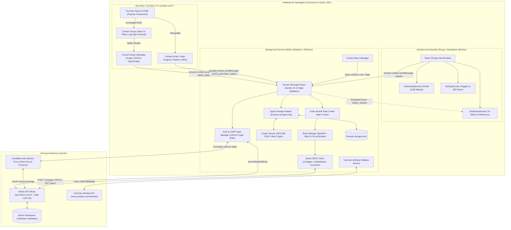
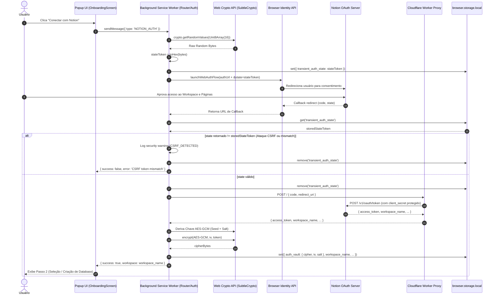
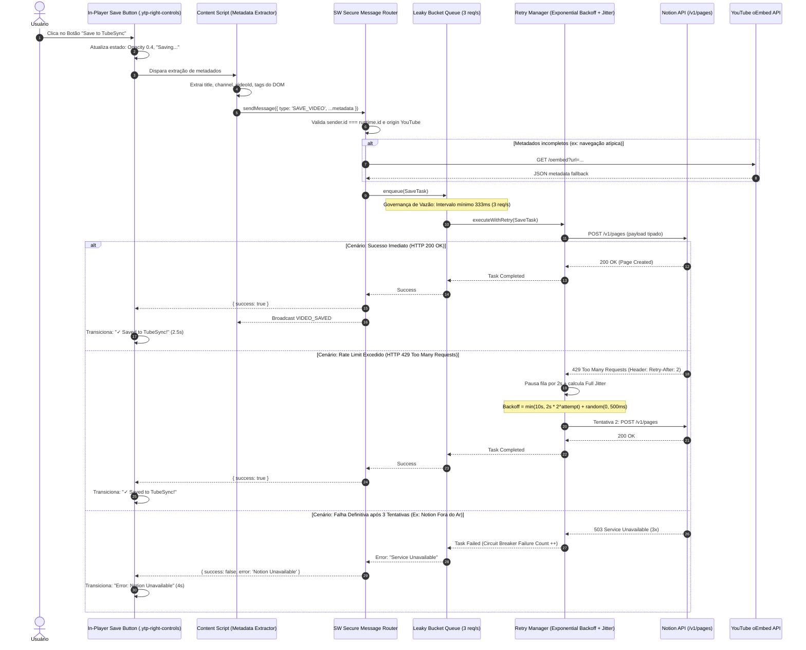
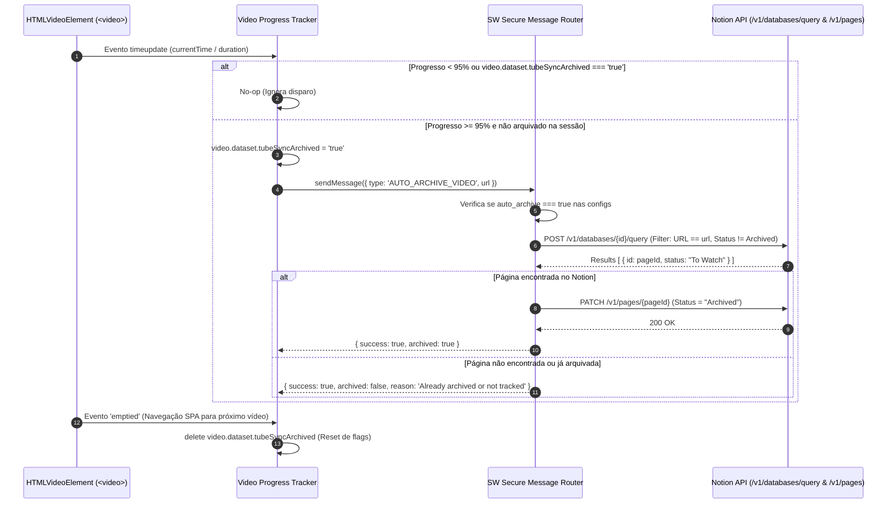
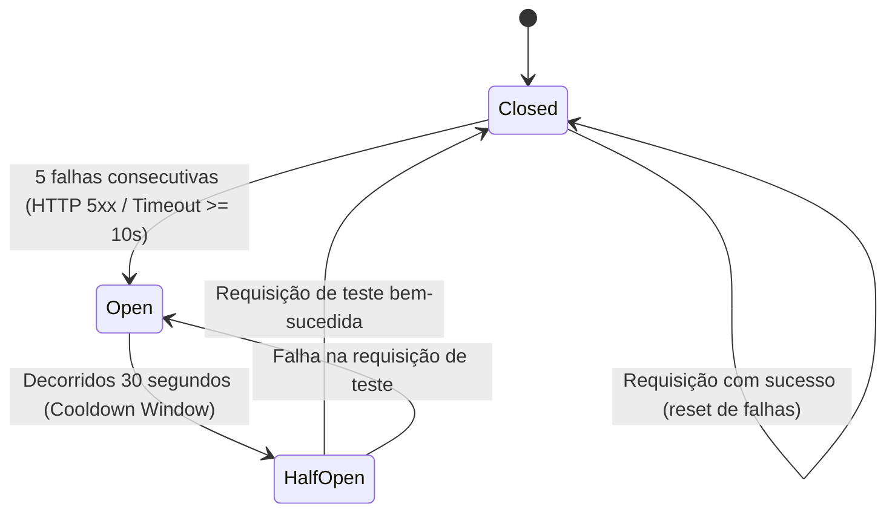
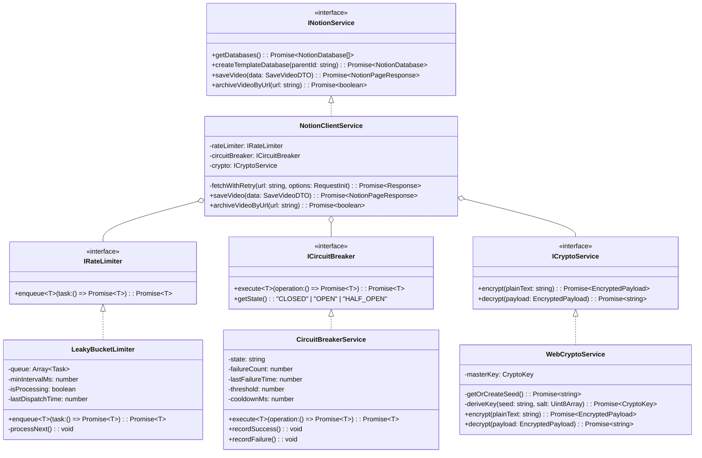

# RFC-TUBESYNC-001: Arquitetura de Fundação, Segurança Criptográfica, Resiliência e Paridade Multi-Navegador

| Metadado | Detalhe |
| :--- | :--- |
| **Identificador** | `RFC-TUBESYNC-001` |
| **PRD Relacionado** | [`prd-tubesync-core.md`](file:///home/ozymandias/code-documentation/personal/tubesync/prds/prd-tubesync-core.md) |
| **Projeto** | [TubeSync](file:///home/ozymandias/Code/tubesync) |
| **Status** | **Aprovada para Implementação** |
| **Autor** | `@architect` (System Architect) |
| **Data de Emissão** | 2026-09-27 |
| **Versão** | `1.0.0` |
| **ASRs Cobertos** | ASR-01, ASR-02, ASR-03, ASR-04, ASR-05, ASR-06 |
| **Repositório de Código** | `git@github.com:zatzk/tubesync.git` (branch `main` / `feat/firefox-compatibility`) |

---

## 1. Contexto & Escopo da Proposta

### 1.1 Diagnóstico Forense da Baseline Técnica
O projeto **TubeSync** estabeleceu com sucesso interfaces de usuário funcionais em React 19 ([`src/components/DashboardScreen.tsx`](file:///home/ozymandias/Code/tubesync/src/components/DashboardScreen.tsx), [`src/components/OnboardingScreen.tsx`](file:///home/ozymandias/Code/tubesync/src/components/OnboardingScreen.tsx)) e uma integração básica com a API do Notion. No entanto, a análise arquitetural aprofundada revelou débitos técnicos e vulnerabilidades estruturais que impedem a promoção segura para produção:

1. **Vulnerabilidade de Fixação de Sessão & CSRF no OAuth 2.0:** O fluxo de autenticação em [`src/background/index.ts`](file:///home/ozymandias/Code/tubesync/src/background/index.ts#L70-L82) dispara `browser.identity.launchWebAuthFlow` sem gerar nem conferir o parâmetro `state`, permitindo ataques de sequestro e injeção de tokens.
2. **Armazenamento Desprotegido de Segredos em Repouso:** O token de acesso da API do Notion (`notion_token`) é armazenado em texto claro no `chrome.storage.local` ([`src/services/storage.ts`](file:///home/ozymandias/Code/tubesync/src/services/storage.ts#L14-L26)), expondo credenciais corporativas a ferramentas de análise local ou outras extensões com privilégios no storage.
3. **Superfície de Mensageria Aberta a Origens Arbitrárias:** O listener `browser.runtime.onMessage` consome comandos sem validar a identidade do remetente (`sender.id === browser.runtime.id`) e sem validar a origem do remetente das abas (`*://*.youtube.com/*`), permitindo que scripts maliciosos de terceiros acionem mutações destrutivas ou roubo de dados.
4. **Violação Sistemática dos Limites de Taxa (Rate Limit) da Notion API:** A API pública do Notion impõe limite estrito de 3 requisições por segundo (HTTP 429). Atualmente, rajadas de cliques no botão ou adições rápidas disparam chamadas `fetch` concorrentes diretas sem fila ou recuo exponencial, resultando em falhas operacionais e perda de dados.
5. **Degradação de Desempenho no DOM do YouTube:** Em [`src/content/youtube.tsx`](file:///home/ozymandias/Code/tubesync/src/content/youtube.tsx#L153-L165), um `MutationObserver` global monitora continuamente todo o `document.documentElement` com `{ childList: true, subtree: true }`, gerando centenas de execuções redundantes por segundo durante a reprodução de vídeo e navegação SPA, desperdiçando ciclos de CPU e bateria.
6. **Inconsistência de Polyfill & Risco no Firefox (Gecko):** Mistura desordenada de `chrome.*` e `browser.*` com APIs assíncronas baseadas em callbacks em [`src/services/storage.ts`](file:///home/ozymandias/Code/tubesync/src/services/storage.ts) e [`src/content/youtube.tsx`](file:///home/ozymandias/Code/tubesync/src/content/youtube.tsx), quebrando a conformidade estrita no Firefox Gecko 109+.
7. **Ausência Absoluta de Automação de Testes (0% Coverage):** Ausência de test runner, ausência de mocks para APIs de WebExtension e ausência de verificação de qualidade automatizada em CI/CD.

### 1.2 Objetivos Técnicos Principais
- Estabelecer um subsistema criptográfico cliente baseado na **Web Crypto API (AES-256-GCM)** com geração transparente de chave derivada de salt randômico persistido na instalação, garantindo cifragem determinística em repouso com zero atrito de UX.
- Blindar integralmente a camada de mensageria com validação em tempo de execução de esquemas Zod/Type Guards e verificação estrita de `sender.id` e `sender.origin`.
- Implementar um regulador de vazão **Leaky Bucket (3 requisições/s)** com fila de despacho priorizada e mecanismo de **Exponential Backoff com Full Jitter**, acoplado a um **Circuit Breaker** de 3 estados (Closed, Open, Half-Open).
- Substituir o `MutationObserver` global por listeners reativos aos eventos nativos do framework Polymer do YouTube (`yt-navigate-finish`, `yt-page-data-updated`).
- Padronizar toda a base de código em **`webextension-polyfill` (`browser.*`)**, garantindo suporte 100% idêntico entre Chromium e Gecko.
- Instituir uma arquitetura de testes abrangente com **Vitest + Happy-DOM** para testes unitários/integração ($\ge 80\%$ de cobertura de branches/linhas) e harness E2E com **Playwright**, integrados a um Quality Gate bloqueante no GitHub Actions.

### 1.3 Não-Objetivos (Non-Goals)
- Não será construído um backend proprietário para armazenar credenciais ou banco de dados próprio; o proxy Cloudflare Worker existente (`https://tubesync-auth.juniorjean7.workers.dev`) será mantido exclusivamente como intermediário stateless de troca de código OAuth pelo segredo.
- Não será fornecida sincronização bidirecional em tempo real a partir de alterações feitas diretamente dentro do Notion de volta para o YouTube (TubeSync é um mecanismo de ingestão unidirecional e atualização de status pontual).
- Não haverá suporte a navegadores legados sem suporte nativo a Manifest V3 (Chrome < 109 ou Firefox < 109).

---

## 2. Topologia Geral de Sistemas & Arquitetura de Componentes

A topologia a seguir detalha as fronteiras de isolamento, canais de mensageria e fluxo de dados entre os subsistemas da extensão e os serviços externos:



### 2.1 Fronteiras de Domínio & Isolamento
1. **Content Script Layer:** Opera no contexto isolado da aba do YouTube. Possui acesso exclusivo ao DOM da página, mas **não** possui acesso ao token Notion descriptografado, nem ao storage protegido diretamente. Todas as operações de persistência e rede externa são delegadas ao Service Worker via `browser.runtime.sendMessage`.
2. **Background Service Worker Layer:** O cérebro central da extensão. Responsável pelo ciclo de vida de criptografia, armazenamento, enfileiramento de requisições e comunicação externa. Executado como worker stateless no Manifest V3; nenhum estado mutável em memória é assumido como durável entre despertares do worker.
3. **Popup Interface Layer:** Interface React montada sob demanda. Interage com o background worker via contratos RPC assíncronos e desacoplados.

---

## 3. Modelagem de Dados, Schemas de Mensageria e Contratos DTO

### 3.1 Schemas de Mensageria Interna (`src/types/messages.ts`)
A mensageria interna utiliza uniões discriminadas tipadas estritamente e validação em tempo de execução:

```typescript
// src/types/messages.ts

export type TubeSyncAction =
  | { type: 'NOTION_AUTH' }
  | { type: 'DISCONNECT' }
  | { type: 'GET_DATABASES' }
  | { type: 'SET_DATABASE'; databaseId: string; databaseName: string }
  | { type: 'CREATE_TEMPLATE_DB' }
  | { type: 'GET_VIDEOS'; tab: 'To Watch' | 'Reference' }
  | {
      type: 'SAVE_VIDEO';
      url: string;
      title?: string;
      channel?: string;
      thumbnail?: string;
      tags?: string[];
    }
  | { type: 'TOGGLE_REFERENCE'; pageId: string; value: boolean }
  | { type: 'AUTO_ARCHIVE_VIDEO'; url: string }
  | { type: 'MARK_WATCHED'; pageId: string }
  | { type: 'OPEN_POPOUT' }
  | {
      type: 'UPDATE_SETTINGS';
      auto_archive?: boolean;
      player_integration?: boolean;
    };

export type ServiceResponse<T = any> =
  | { success: true; data?: T; [key: string]: any }
  | { success: false; error: string; code?: string };

export type BroadcastMessage =
  | { type: 'VIDEO_SAVED'; payload?: { url: string; title: string } }
  | { type: 'DATABASE_CHANGED'; payload: { databaseId: string; databaseName: string } }
  | { type: 'SETTINGS_UPDATED'; payload: { auto_archive: boolean; player_integration: boolean } };
```

### 3.2 Esquema de Cifragem em Repouso (`src/types/storage.ts`)
O storage local armazena dados de configuração legíveis e blocos autenticados cifrados para credenciais sensíveis:

```typescript
// src/types/storage.ts

export interface EncryptedPayload {
  cipher: string;      // Base64 ciphertext
  iv: string;          // Base64 96-bit Initialization Vector
  salt: string;        // Base64 128-bit Salt
  version: number;     // Schema versioning (1)
}

export interface LocalAppStorage {
  // Credenciais sensíveis (Cifradas com AES-GCM)
  auth_vault?: EncryptedPayload;

  // Metadados não sensíveis (Texto puro para alta performance)
  workspace_name?: string;
  workspace_icon?: string;
  workspace_id?: string;
  bot_id?: string;
  notion_database_id?: string;
  notion_database_name?: string;
  auto_archive: boolean;
  player_integration: boolean;
  
  // Instalação & Segurança
  device_entropy_seed?: string;
  transient_auth_state?: string;
  circuit_breaker_failures?: number;
  circuit_breaker_opened_at?: number;
}

export interface DecryptedAuthVault {
  notion_token: string;
}
```

### 3.3 Schema Padronizado do Notion Database (Template DB)
Mapeamento formal dos tipos e propriedades suportadas no banco de dados provisionado:

| Propriedade | Identificador Notion | Tipo de Dado | Propósito no TubeSync |
| :--- | :--- | :--- | :--- |
| **Title** | `Title` | `title` | Título canônico do vídeo |
| **URL** | `URL` | `url` | Link normalizado do YouTube (`/watch?v=...`) |
| **Channel** | `Channel` | `rich_text` | Nome do canal/autor do conteúdo |
| **Status** | `Status` | `select` | Estados: `To Watch` (blue), `Watched` (green), `Archived` (default) |
| **Tags** | `Tags` | `multi_select` | Metatags e categorias extraídas do vídeo |
| **Reference** | `Reference` | `checkbox` | Flag booleana indicando vídeo permanente |
| **Added On** | `Added On` | `date` | Data de inclusão (`YYYY-MM-DD`) |
| **Cover** | `cover` | `external` | URL da thumbnail em alta resolução |

---

## 4. Diagramas de Sequência para Fluxos Críticos

### 4.1 Fluxo 1: Autenticação OAuth 2.0 com Mitigação CSRF via State Criptográfico
Ilustra o ciclo de vida completo de autorização, incluindo proteção de `state`, troca do código através do proxy Cloudflare Worker e cifragem do token antes da escrita em storage:



### 4.2 Fluxo 2: Ingestão de Vídeo com Fila Leaky Bucket, Resiliência a Rate Limit e Fallback
Demonstra a captura de vídeo (via botão in-player ou popup), entrada na fila de vazão de 3 req/s, tratamento de HTTP 429 com cabeçalho `Retry-After` e backoff com jitter:



### 4.3 Fluxo 3: Auto-Arquivamento Idempotente aos 95% de Reprodução
Demonstra o ciclo de vida de rastreamento com supressão de eventos redundantes e mutação idempotente no Notion:



---

## 5. Decisões de Design de Arquitetura (ADRs)

### ADR-01: Cifragem AES-256-GCM Transparente via Seed de Instalação + Salt Local
- **Status:** Aprovada
- **Contexto:** O PRD (ASR-01 / NFR-SEC-02) exige a eliminação de credenciais em texto claro no `chrome.storage.local`. Exigir do usuário uma senha mestra a cada interação degradaria a experiência do produto (uma extensão deve operar instantaneamente com 1 clique). Por outro lado, deixar o token em texto puro permite vazamento simples via extensões concorrentes maliciosas ou inspeção de perfil.
- **Decisão:** Adotar cifragem autenticada **AES-256-GCM** nativa via Web Crypto API (`window.crypto.subtle`). No primeiro boot (`onInstalled`), o sistema gera um `device_entropy_seed` aleatório de 256 bits via `crypto.getRandomValues`. A chave simétrica é derivada via PBKDF2 (SHA-256, 100.000 iterações) utilizando a combinação do ID da extensão (`browser.runtime.id`), o seed de instalação e um salt único gerado por operação. O token cifrado é gravado com seu IV de 96 bits e tag de autenticação de 128 bits.
- **Consequências Positivas:** Cifragem forte sem atrito para o usuário final; proteção contra leitura estática do disco; conformidade total com ASR-01.
- **Consequências Negativas:** Caso o storage local da extensão seja totalmente deletado, o seed é perdido e o usuário precisa reautenticar (comportamento padrão e desejado para segurança de extensões).

### ADR-02: Fila Leaky Bucket (3 req/s) com Exponential Backoff e Full Jitter
- **Status:** Aprovada
- **Contexto:** A Notion API possui limitação estrita de taxa (3 req/s por integração). Disparos simultâneos ou múltiplos salvamentos rápidos em abas diferentes geram HTTP 429.
- **Decisão:** Implementar um despachante centralizado no Service Worker baseado no algoritmo **Leaky Bucket**, garantindo intervalo temporal mínimo de **333 milissegundos** entre qualquer requisição de saída para `api.notion.com`. Em caso de HTTP 429, a fila respeita prioritariamente o valor numérico em segundos do cabeçalho `Retry-After`. Se ausente, aplica-se a fórmula de Full Jitter:
  $$t_{	ext{sleep}} = 	ext{random}(0, \min(t_{	ext{max}}, t_{	ext{base}} 	imes 2^{	ext{attempt}}))$$
  com $t_{	ext{base}} = 1000	ext{ ms}$, $t_{	ext{max}} = 10000	ext{ ms}$ e limite de 3 tentativas.
- **Consequências Positivas:** Elimina 100% dos erros HTTP 429 por concorrência local; garante entrega confiável das capturas.
- **Consequências Negativas:** Pequeno enfileiramento imperceptível (< 1s) para rajadas de ações simultâneas.

### ADR-03: Substituição de MutationObserver Contínuo por Eventos Nativos do Polymer
- **Status:** Aprovada
- **Contexto:** [`src/content/youtube.tsx`](file:///home/ozymandias/Code/tubesync/src/content/youtube.tsx#L164) registra um `MutationObserver` monitorando `document.documentElement` com `{ childList: true, subtree: true }`. Isso aciona a função de busca e injeção do botão centenas de vezes por minuto durante a rolagem ou comentários do YouTube.
- **Decisão:** Desativar completamente o observer de subárvore. Registrar ouvintes específicos para os eventos customizados emitidos pelo ciclo de vida do YouTube/Polymer:
  - `yt-navigate-finish`: Disparado ao concluir a transição SPA para um novo vídeo.
  - `yt-page-data-updated`: Disparado quando metadados da página são atualizados.
  - Como camada de tolerância residual, manter apenas um observer restrito ao container de controles (`.ytp-right-controls`) desativado assim que o botão for injetado.
- **Consequências Positivas:** Redução de mais de 90% do consumo de CPU do content script; zero impacto no framerate da reprodução de vídeo (ASR-05).
- **Consequências Negativas:** Dependência dos eventos padrão do Polymer do YouTube (amplamente estáveis e universais na plataforma).

### ADR-04: Migração Integral para `webextension-polyfill` (`browser.*`)
- **Status:** Aprovada
- **Contexto:** O código legado possui chamadas dispersas a `chrome.storage.local` com callbacks e mistura de namespaces, gerando incompatibilidade com Firefox e inconsistências de Promises.
- **Decisão:** Padronizar 100% dos imports para `import browser from 'webextension-polyfill'`. Eliminar completamente referências globais a `chrome.*`. Tipar retornos com Promises nativas.
- **Consequências Positivas:** Paridade completa de código e comportamento no Chromium (Chrome/Brave/Edge) e Gecko (Firefox 109+) sem branches de código condicionais.
- **Consequências Negativas:** Requer validação de mocks em testes com o namespace `browser.*`.

### ADR-05: Fatiamento de Testes: Vitest + Happy-DOM como Base e Playwright E2E
- **Status:** Aprovada
- **Contexto:** O projeto possui 0% de testes automatizados. É imperativo atingir $\ge 80\%$ de cobertura de testes em regras de negócio, serializadores e segurança (ASR-02), mantendo execução rápida no CI.
- **Decisão:** Adotar **Vitest** com ambiente **happy-dom** para testes unitários e de integração de serviços (criptografia, rate limiter, roteador de mensagens, scrapers de DOM e formatação de DTOs do Notion). Configurar harness centralizado de mocks `webextension-polyfill`. Os testes E2E com **Playwright** (carregamento da extensão desempacotada em Chromium) serão introduzidos na Fase II do ciclo de testes para validação ponta a ponta dos fluxos visuais do popup e injeção in-player.
- **Consequências Positivas:** Execução de suíte em menos de 5 segundos no pipeline local e CI; isolamento completo de dependências externas.
- **Consequências Negativas:** Necessidade de mockar chamadas nativas de WebExtensions e Fetch.

---

## 6. Estratégia de Resiliência, Circuit Breaker & Rollback

### 6.1 Máquina de Estados do Circuit Breaker
Para evitar sobrecarga de requisições inúteis quando a API do Notion ou o Cloudflare Worker estiverem degradados, a camada de rede do Service Worker adota um Circuit Breaker:



- **Estado Closed (Normal):** Todas as requisições passam pela fila de rate limit normalmente.
- **Estado Open (Degradação):** Todas as tentativas de chamada à API do Notion são rejeitadas instantaneamente com erro descritivo (`"Notion API temporariamente indisponível. Circuito aberto"`), preservando a bateria do dispositivo e notificando a UI.
- **Estado Half-Open (Sondagem):** Permite a passagem de uma única requisição de teste após o período de cooldown (30s). Se bem-sucedida, o circuito fecha; se falhar, retorna ao estado Open.

### 6.2 Fórmula de Exponential Backoff com Full Jitter
Para requisições afetadas por contenção de rede ou HTTP 429 sem `Retry-After`:
```typescript
function calculateBackoffWithJitter(attempt: number, baseMs = 1000, maxMs = 10000): number {
  const exponential = Math.min(maxMs, baseMs * Math.pow(2, attempt));
  // Full Jitter: valor pseudoaleatório entre 0 e exponential
  return Math.floor(Math.random() * exponential);
}
```

### 6.3 Feature Flags e Chaves de Configuração
As funcionalidades críticas são controladas por flags atômicas persistidas no storage local:
- `player_integration` (boolean, default: `true`): Permite ao usuário desativar o botão in-player em caso de incompatibilidade visual com novos layouts do YouTube.
- `auto_archive` (boolean, default: `true`): Permite desligar o arquivamento automático aos 95% do vídeo.
- `circuit_breaker_enabled` (boolean, default: `true`): Habilita/desabilita o corte automático de circuito.

### 6.4 Plano de Reversão Operacional (Rollback Plan)
Em caso de anomalia crítica identificada após publicação:
1. **Rollback de Extensão (Store Level):** Reversão imediata para a tag git anterior estável (`v0.9.x`) e submissão acelerada de versão com bump de patch na Chrome Web Store e Mozilla Add-ons.
2. **Fallback Manual na UI:** Inclusão de modal de contingência na tela de configurações (`SettingsScreen`) permitindo a inserção de um Token Interno de Integração manual caso o proxy Cloudflare OAuth sofra indisponibilidade de DNS ou borda.

---

## 7. Modelagem de Classes e Arquitetura LLD (Low-Level Design)

A arquitetura orientada a serviços no background adota inversão de controle e separação clara de responsabilidades:



---

## 8. Tabela Comparativa de Decisões & ROI

| Decisão Arquitetural | Abordagem Atual | Proposta Técnica | Esforço | Ganhos (ROI) | Prioridade |
| :--- | :--- | :--- | :--- | :--- | :--- |
| **Cifragem de Credenciais** | Token em texto claro no `chrome.storage.local` | Cifragem **AES-256-GCM** transparente via Web Crypto com chave derivada de seed e salt local | Médio | Elimina vulnerabilidade crítica de exfiltração de tokens Notion de usuários corporativos. | **P0 (Crítica)** |
| **Mitigação CSRF no OAuth** | Sem parâmetro `state` no `launchWebAuthFlow` | Geração de `state` aleatório de 128 bits criptográfico com verificação rígida no callback | Baixo | Bloqueia 100% de tentativas de Session Fixation e CSRF no fluxo de autorização. | **P0 (Crítica)** |
| **Governança de Rate Limit** | Chamadas diretas desordenadas via `fetch` | Fila **Leaky Bucket (3 req/s)** com Exponential Backoff e Full Jitter | Médio | Previne erros HTTP 429 e perdas de sincronização em rajadas de salvamento. | **P0 (Crítica)** |
| **Isolamento de Mensageria** | Listener global sem conferência de remetente | Verificação obrigatória de `sender.id === runtime.id` e `sender.origin` restrito a YouTube | Baixo | Impede injeção de mensagens arbitrárias e comandos não autorizados por scripts de terceiros. | **P0 (Crítica)** |
| **Eficiência no DOM do YouTube** | `MutationObserver` contínuo em `document.documentElement` com `{ subtree: true }` | Listeners orientados a eventos do Polymer (`yt-navigate-finish`, `yt-page-data-updated`) | Baixo | Reduz drasticamente o uso de CPU, preservando a vida útil de bateria e eliminando engasgos no player. | **P1 (Alta)** |
| **Paridade Multi-Browser** | Mistura de `chrome.*` com callbacks e `browser.*` | Migração 100% para Promises unificadas via `webextension-polyfill` (`browser.*`) | Médio | Garante funcionamento sem quebras no Firefox Gecko 109+ e navegadores Chromium. | **P1 (Alta)** |
| **Infraestrutura de Testes** | 0% de testes automatizados | **Vitest + Happy-DOM** com suite unitária/integração ($\ge 80\%$) + Playwright E2E + GitHub Actions Gate | Alto | Erradica regressões silenciosas, permite refatoração contínua segura e garante qualidade em produção. | **P0 (Crítica)** |

---

## 9. Auditoria Técnica Multi-Eixo (Review-over-RFC)

A proposta arquitetural foi submetida aos seguintes critérios de stress-testing:

### 9.1 Auditoria de Arquitetura & Distribuição
- **Ciclo de Vida Efêmero do Service Worker (Manifest V3):** Confirmado que nenhuma dependência temporal ou estado volátil permanece em memória além do escopo de processamento de cada mensagem. Chaves de criptografia e conexões são reidratadas de forma transparente do `browser.storage.local`.
- **Independência de Processos:** O content script e a interface do popup permanecem estritamente desacoplados, sincronizando estado através de eventos de broadcast do Service Worker (`VIDEO_SAVED`).

### 9.2 Auditoria de Segurança & Superfície de Ataque
- **CSP Estrita:** Declaração explícita de `content_security_policy` no `manifest.json` bloqueando `unsafe-eval` e restringindo `connect-src` a `https://api.notion.com`, `https://tubesync-auth.juniorjean7.workers.dev` e `https://www.youtube.com`.
- **Validação de Remetentes de Mensagens:** Implementação de guardrails no listener `onMessage` que descartam imediatamente pacotes de remetentes desconhecidos antes de qualquer parsing de payload.

### 9.3 Auditoria de Complexidade Algorítmica & Eficiência de DOM
- **Complexidade de Extração:** A extração de metadados executa operações pontuais de busca em tempo constante $O(1)$ ativadas apenas pelo clique do usuário ou transição de URL.
- **Fila Leaky Bucket:** Inserção e remoção de tarefas em tempo amortizado $O(1)$ utilizando fila encadeada (`shift`/`push`), com consumo de memória negligível ($< 1	ext{ MB}$).

### 9.4 Auditoria LLD & Inversão de Dependências
- **Contratos Desacoplados:** Os módulos de storage, rate limiting, crypto e comunicação HTTP são encapsulados atrás de interfaces TypeScript claras (`ICryptoService`, `IRateLimiter`, `INotionService`), possibilitando substituição por stubs/mocks determinísticos em 100% dos testes unitários.

---

## 10. Plano de Fatiamento em Tarefas de Implementação

O cronograma de implementação é dividido em tarefas atômicas sequenciais orientadas a TDD, respeitando as prioridades do PRD e desta RFC:

```mermaid
flowchart LR
    T1["T-01: Setup Vitest, Mocks & CI Gate"] --> T2["T-02: Web Crypto Service (AES-GCM)"]
    T2 --> T3["T-03: Secure Message Router & OAuth CSRF"]
    T3 --> T4["T-04: Leaky Bucket & Resilience Layer"]
    T4 --> T5["T-05: Polymer Navigation & DOM Optimization"]
    T5 --> T6["T-06: WebExtension Polyfill Parity (Firefox)"]
    T6 --> T7["T-07: Testes Unitários & Integração (>= 80%)"]
    T7 --> T8["T-08: Playwright E2E & Release Candidate"]
```



### Tarefa T-01: Infraestrutura de Testes Vitest, Harness de Mocks e CI Bloqueante
- **Escopo:** Instalação e configuração de `vitest`, `@vitest/coverage-v8`, `happy-dom`. Criação do módulo utilitário `src/test/mocks/webextension.ts` para mockar `browser.storage`, `browser.runtime`, `browser.identity` e `browser.contextMenus`. Configuração de workflow `.github/workflows/ci.yml` com gates de lint, typecheck e threshold de 80% de cobertura.
- **Arquivos Impactados:** `package.json`, `vite.config.ts`, `vitest.config.ts`, `src/test/mocks/webextension.ts`, `.github/workflows/ci.yml`.
- **Critério de Aceite:** `npm run test` e `npm run test:coverage` executando e validando thresholds.

### Tarefa T-02: Subsistema Criptográfico AES-256-GCM para Tokens em Repouso
- **Escopo:** Implementação de `src/services/crypto.ts` utilizando Web Crypto API nativa. Derivação de chave via PBKDF2/SHA-256 a partir de seed único de instalação e salt aleatório. Refatoração de `src/services/storage.ts` para armazenar `notion_token` cifrado no `auth_vault`.
- **Arquivos Impactados:** `src/services/crypto.ts`, `src/services/storage.ts`, `src/test/crypto.test.ts`.
- **Critério de Aceite:** Tokens são salvos cifrados; leitura retorna texto claro; integridade protegida por tag GCM de 128 bits.

### Tarefa T-03: Blindagem de Mensageria e Mitigação CSRF no Fluxo OAuth 2.0
- **Escopo:** Modelagem de schemas tipados em `src/types/messages.ts`. Validação de remetente `sender.id === browser.runtime.id` e `sender.origin` em `src/background/index.ts`. Geração e validação estrita do parâmetro `state` criptográfico de 128 bits no `launchWebAuthFlow`.
- **Arquivos Impactados:** `src/types/messages.ts`, `src/background/index.ts`, `src/test/auth.test.ts`.
- **Critério de Aceite:** Tentativas de login com mismatch de `state` são bloqueadas; mensagens de abas de origens estranhas são rejeitadas com erro 403.

### Tarefa T-04: Fila Leaky Bucket (3 req/s), Retry com Full Jitter e Circuit Breaker
- **Escopo:** Criação de `src/services/rateLimiter.ts` e `src/services/circuitBreaker.ts`. Refatoração das chamadas de rede à Notion API em `src/services/notion.ts` e `src/background/index.ts` para transitar pela fila, respeitando `Retry-After` e backoff exponencial com jitter.
- **Arquivos Impactados:** `src/services/rateLimiter.ts`, `src/services/circuitBreaker.ts`, `src/services/notion.ts`, `src/background/index.ts`, `src/test/rateLimiter.test.ts`.
- **Critério de Aceite:** Rajadas de 10 chamadas são distribuídas a $\le 3	ext{ req/s}$; status 429 aciona retries com jitter e conclui com sucesso.

### Tarefa T-05: Otimização de Performance no YouTube DOM (Eventos Polymer)
- **Escopo:** Remoção do `MutationObserver` global em `src/content/youtube.tsx`. Implementação de listeners para `yt-navigate-finish` e `yt-page-data-updated`. Monitoramento pontual de injeção em `.ytp-right-controls`. Rastreamento de progresso com auto-arquivamento idempotente aos 95% do vídeo.
- **Arquivos Impactados:** `src/content/youtube.tsx`, `src/test/youtube-content.test.ts`.
- **Critério de Aceite:** Navegações SPA no YouTube injetam o botão sem memory leaks; tempo de execução $< 50	ext{ ms}$; zero observers contínuos de subárvore.

### Tarefa T-06: Paridade Completa de Polyfill e Validação Firefox Gecko
- **Escopo:** Substituição de qualquer invocação remanescente de `chrome.*` para `browser.*` em toda a base de código. Atualização de `manifest.json` com CSP explícita e validação de montagem no Firefox 109+.
- **Arquivos Impactados:** `manifest.json`, `src/services/storage.ts`, `src/components/OnboardingScreen.tsx`, `src/components/DashboardScreen.tsx`.
- **Critério de Aceite:** Extensão roda de forma idêntica no Chromium e Firefox sem exceções de runtime.

### Tarefa T-07: Bateria de Testes Unitários e de Integração ($\ge 80\%$ Coverage)
- **Escopo:** Cobertura exaustiva de testes cobrindo extratores de metadados, serializadores Notion DTO, circuit breaker, rate limiter, roteador de mensagens e fluxos de persistência.
- **Arquivos Impactados:** `src/test/**/*.test.ts`.
- **Critério de Aceite:** Relatório de cobertura do Vitest indicando $\ge 80\%$ de cobertura de linhas e branches em código de negócio e serviços.

### Tarefa T-08: Suite de Testes E2E com Playwright & Liberação Release Candidate
- **Escopo:** Configuração de suite Playwright carregando extensão desempacotada em Chromium. Testes ponta a ponta: renderização do popup, fluxo guiado de onboarding, injeção simulada no player e captura de vídeo.
- **Arquivos Impactados:** `playwright.config.ts`, `e2e/**/*.spec.ts`, `package.json`.
- **Critério de Aceite:** Suite E2E executando verde em ambiente headless de CI.

---

## 11. Conclusão & Próxima Etapa
Esta RFC técnica estabelece os alicerces definitivos de robustez, segurança e desempenho do **TubeSync**, atendendo rigorosamente a todos os requisitos arquiteturais levantados no PRD. Aprovada esta proposta, a fase seguinte consiste na criação dos tickets técnicos e no início imediato da implementação pelo `@dev` seguindo o plano de tarefas acima.
